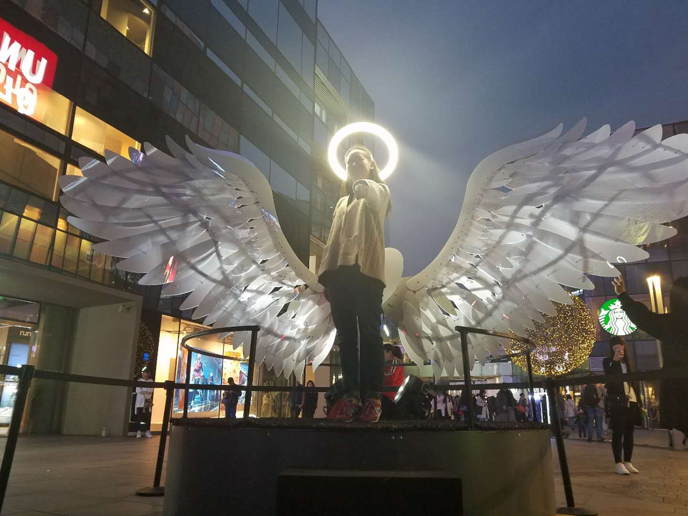

class: center, middle

# 自我介绍

&nbsp;
&nbsp;

#### 张玉婷 (brilliant.99@pku.edu.cn)  

主页: https://github.com/zytpku

---

## 主要内容

### 1. 第一部分

#### &nbsp; &nbsp; 1.1 我的基本信息
#### &nbsp; &nbsp; 1.2 我的爱好
#### &nbsp; &nbsp; 1.3 我的特点

---

## 第一部分

###1.1
我的名字是张玉婷，我是17级元培学院的学生
###1.2
我喜欢跑步，爬山，和车协的小伙伴们一起骑车。
另外，，我还喜欢看电影，经常在周末的时候和小伙伴们一起去电影院
###1.3
我的特点是喜欢和有意思的人做有意思的事

---

## 放一张我的美照

** Ada Lovelace **

---

# 谢谢
